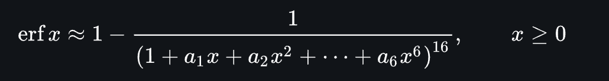
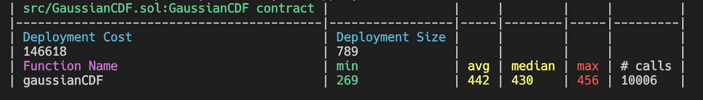

# 2024 Paradigm Fellowship - Gaussian CDF Approximation

```
Implement a maximally optimized gaussian CDF on the EVM for arbitrary 18 decimal fixed point parameters x, μ, σ. Assume -1e20 ≤ μ ≤ 1e20 and 0 < σ ≤ 1e19. Should have an error less than 1e-8 vs errcw/gaussian for all x on the interval [-1e23, 1e23].
```

My calculation of Gaussian CDF is based on the Abramowitz and Stegun approximation of the error functionin order to avoid use of exponentiation due to gas cost and precision concerns for wide `x` range. Instead, I used a rational function approximation, which is more efficient for the Ethereum Virtual Machine (EVM). This approach maintains the required precision while being optimized for gas consumption.



Code is written in inline assembly and optimized for gas efficiency:



Code can be found in: `src/GaussianCDF.sol`

Tests: `test/GaussianCDF.t.sol`

Script for test data generation: `script/generate_test_data.py`
